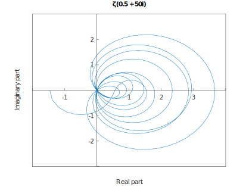

# Plot the Riemann Zeta function



An educational project to learn [Octave][octave website] and plot the
[Zeta][zeta wikipedia] function.

## Testing

```shell
nix develop
```

Then run the applet with octave:

```shell
octave src/zeta.m
```

## Resources

- On Geogebra: https://www.geogebra.org/m/T47QECTP

[octave website]: https://octave.org/
[zeta wikipedia]: https://en.wikipedia.org/wiki/Riemann_zeta_function